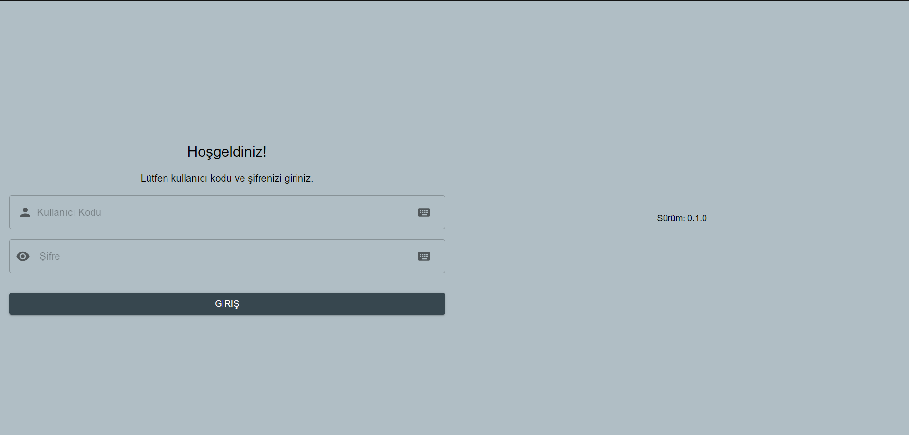
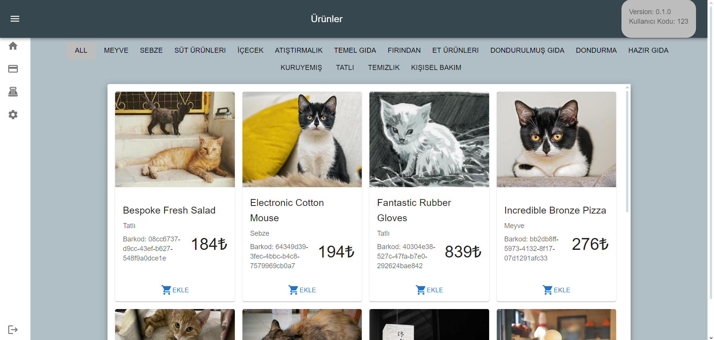
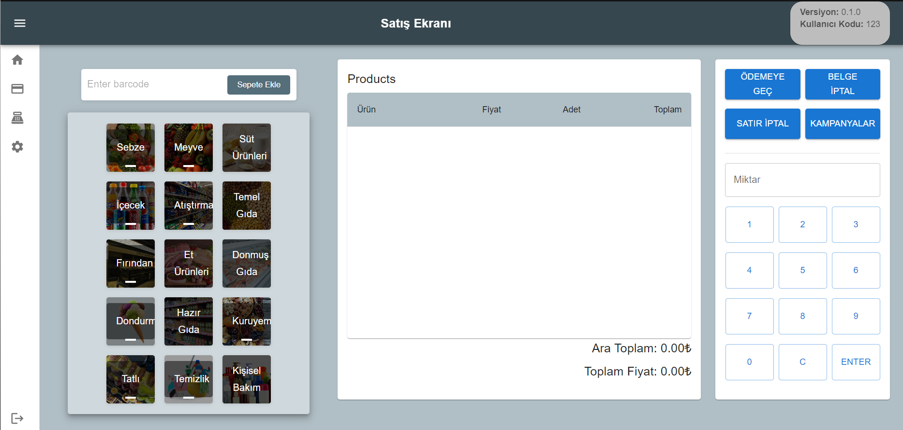
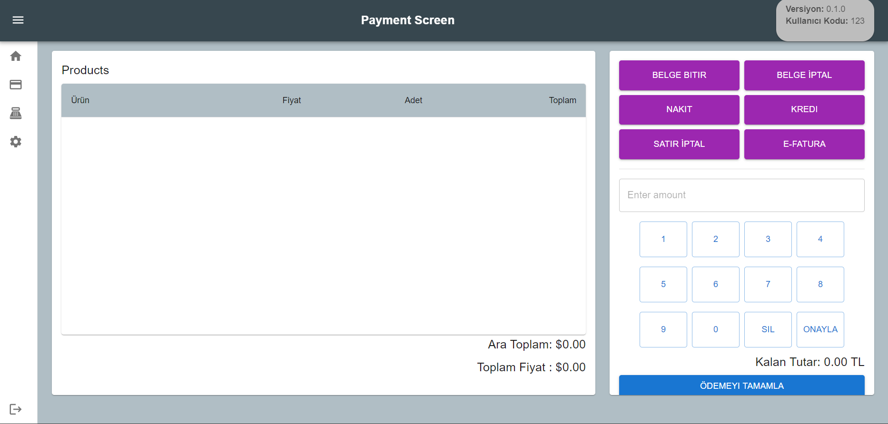

# Web Kasa Application

This project is a web-based cash register application. The application includes various sales and management operations:

## Features

- **Product Sales**: Products can be selected and added to the cart from the homepage or payment page.
- **Campaign Management**: Management and application of campaigns like "buy 3 pay for 2".
- **Barcode Scanning**: Products can be quickly added via barcode scanning.
- **Product Quantity Changes**: The quantity of products in the cart can be changed.
- **Payment Options**: Users can choose between credit card or cash payment options.
- **Receipt Generation**: A receipt is generated after the payment process is completed.

## Functions

- **Adding Products**: Products can be added to the cart from the homepage or payment page, or by barcode scanning.
  
- **Cart Operations**:
  - Products in the cart can be deleted.
  - Transactions in the cart can be canceled.
  - Product quantities can be changed.
  
- **Campaign Management**: The "buy 3 pay for 2" campaign can be activated, showing both campaign and non-campaign prices in the cart.
  
- **Payment**: On the payment page, users can choose a payment option and enter the amount given using the keyboard. The payment process is completed by pressing the "Complete Payment" button.
  
- **Receipt Generation**: A receipt is generated after the payment process is completed and provided to the user. The receipt can be printed.

### Built With

* [![React][React.js]][React-url] - A library for building user interfaces.
* [![CSS][CSS.js]][CSS-url] - A language used to describe the style of web pages.
* [![HTML][HTML.js]][HTML-url] - The standard markup language for creating web pages.
* [![MSW][MSW.js]][MSW-url] (Mock Service Worker)
* [![Faker.js][Faker.js]][Faker-url] - Version: ^8.4.1
* [![Axios][Axios.js]][Axios-url] - Version: ^1.7.2
* [![i18next][i18next.js]][i18next-url] - Version: ^23.11.5
* [![i18next Browser Language Detector][i18next-BLD.js]][i18next-BLD-url] - Version: ^8.0.0
* [![React i18next][React-i18next.js]][React-i18next-url] - Version: ^14.1.2
* [![React Infinite Scroll Component][React-Infinite-Scroll-Component.js]][React-Infinite-Scroll-Component-url] - Version: ^6.1.0
* [![React Simple Keyboard][React-Simple-Keyboard.js]][React-Simple-Keyboard-url] - Version: ^3.7.118

<!-- GETTING STARTED -->
## Getting Started


### Requirements

The required software for using the project and how to install them are given below:
- Node.js (and npm package manager)
- A text editor or IDE

### Installation

1. Clone the repo
   ```sh
   git clone https://github.com/haticebulbul/web-kasa.git

2.Navigate to the project directory
  ```sh
  cd web-kasa
  ```
3. Install NPM packages
   ```sh
   npm install
   ```
4. Start the project
    ```sh
   npm start
   ```   

<!-- USAGE EXAMPLES -->
## Usage


### Login Screen
- Enter user code and password. Displays an error message if the login is incorrect.
- Information can also be entered using a virtual keyboard. The keyboard supports dual languages: English and Turkish.
- Version information is obtained from MSW


  


### Homepage
- Directly navigate to the desired category of products from the homepage.
  


  

### Product Page
- Lists 1000 products using infinite scroll.
- Product information is randomly generated using the Faker library and categorized in MSW.
- Products are added to the cart on the sales screen by clicking the "Add" button.


  


### Sales Screen
- The cart contains a barcode input, a category screen, buttons for operations on the cart, and a keyboard for changing quantities.
- Products can be added to the cart by barcode scanning or from the category screen.
- The quantity can be changed by clicking on the keyboard.
- Clicking the campaign button activates the "buy 3 pay for 2" campaign and affects the total in the cart.
- Pressing the cancel button clears the entire cart and cancels the transaction.
- A single product can be removed from the cart by row operation.


  


### Payment Screen
- On the payment screen, select a payment option and enter the amount given by the user using the keyboard.
- The payment process is completed by pressing the "Complete Payment" button, and a receipt is generated.
- An e-invoice is sent to the entered email address.


<!-- CONTACT -->
## Contact
Hatice Bülbül - [@Linkedin](www.linkedin.com/in/haticebülbül) - Hatice0bulbul@gmail.com

Project Link: [https://github.com/haticebulbul/web-kasa.git](https://github.com/haticebulbul/web-kasa.git)


[React.js]: https://img.shields.io/badge/React-20232A?style=for-the-badge&logo=react&logoColor=61DAFB
[React-url]: https://reactjs.org/
[CSS.js]: https://img.shields.io/badge/CSS-239120?style=for-the-badge&logo=css3&logoColor=white
[CSS-url]: https://developer.mozilla.org/en-US/docs/Web/CSS
[HTML.js]: https://img.shields.io/badge/HTML-E34F26?style=for-the-badge&logo=html5&logoColor=white
[HTML-url]: https://developer.mozilla.org/en-US/docs/Web/HTML
[MSW.js]: https://img.shields.io/badge/MSW-20232A?style=for-the-badge&logo=msw&logoColor=61DAFB
[MSW-url]: https://mswjs.io/
[i18next-BLD-url]: https://www.npmjs.com/package/i18next-browser-languagedetector
[React-i18next.js]: https://img.shields.io/badge/React_i18next-20232A?style=for-the-badge&logo=react&logoColor=61DAFB
[React-i18next-url]: https://www.npmjs.com/package/react-i18next
[React-Infinite-Scroll-Component.js]: https://img.shields.io/badge/React_Infinite_Scroll_Component-20232A?style=for-the-badge&logo=react&logoColor=61DAFB
[React-Infinite-Scroll-Component-url]: https://www.npmjs.com/package/react-infinite-scroll-component
[React-Simple-Keyboard.js]: https://img.shields.io/badge/React_Simple_Keyboard-20232A?style=for-the-badge&logo=react&logoColor=61DAFB
[React-Simple-Keyboard-url]: https://www.npmjs.com/package/react-simple-keyboard
[Faker.js]: https://img.shields.io/badge/Faker-20232A?style=for-the-badge&logo=faker&logoColor=61DAFB
[Faker-url]: https://www.npmjs.com/package/@faker-js/faker
[Axios.js]: https://img.shields.io/badge/Axios-20232A?style=for-the-badge&logo=axios&logoColor=61DAFB
[Axios-url]: https://www.npmjs.com/package/axios
[i18next.js]: https://img.shields.io/badge/i18next-20232A?style=for-the-badge&logo=i18next&logoColor=61DAFB
[i18next-url]: https://www.npmjs.com/package/i18next
[i18next-BLD.js]: https://img.shields.io/badge/i18next_Browser_Language_Detector-20232A?style=for-the-badge&logo=i18next&logoColor=61DAFB
