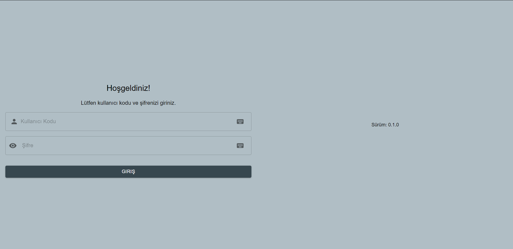
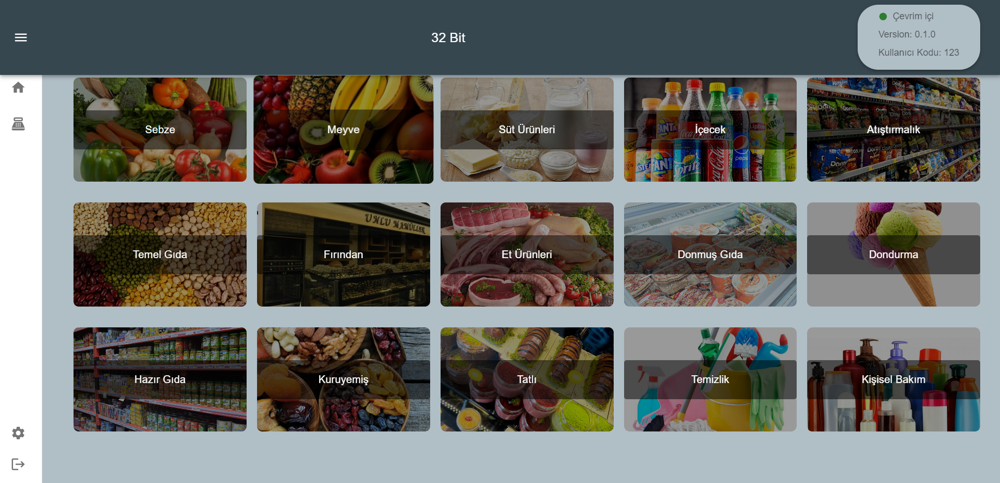
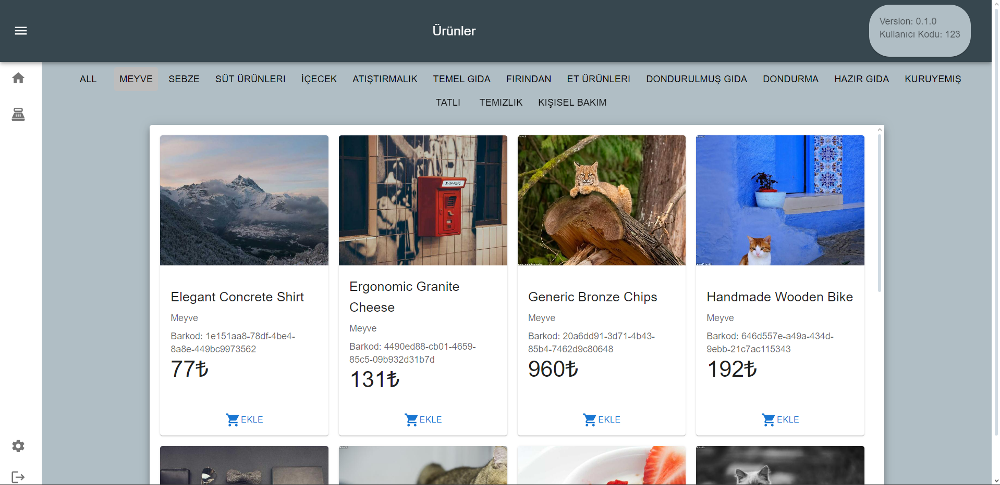
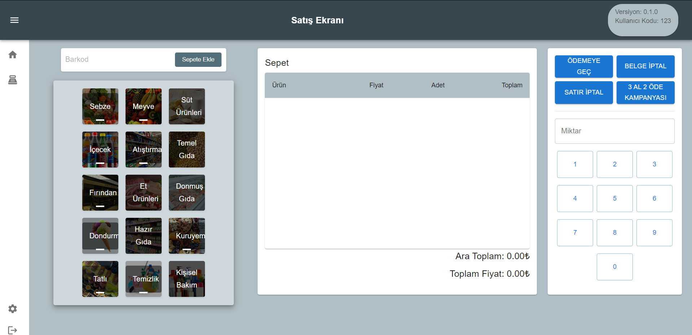
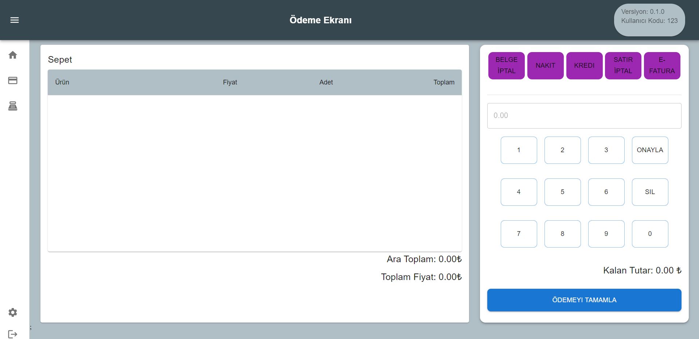
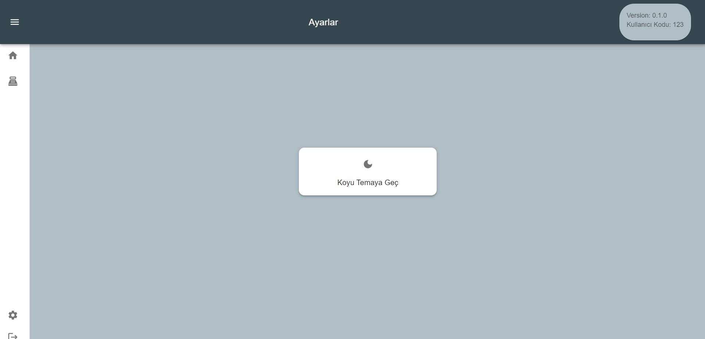

# Web Kasa Uygulaması

Bu proje, bir web tabanlı kasa uygulamasıdır. Uygulama, çeşitli satış ve yönetim işlemlerini içerir:

## Özellikler

- **Ürün Satışı**: Anasayfa veya ödeme sayfasından ürün seçilip sepete eklenebilir.
- **Kampanya Yönetimi**: 3 al 2 öde gibi kampanyaların yönetimi ve uygulanması.
- **Barkod Okutma**: Ürünler barkod ile hızlıca eklenebilir.
- **Ürün Miktar Değişimi**: Sepetteki ürünlerin miktarı değiştirilebilir.
- **Ödeme Seçenekleri**: Kredi kartı veya nakit ödeme seçenekleri arasından seçim yapılabilir.
- **Fiş Oluşturma**: Ödeme işlemi tamamlandıktan sonra fiş oluşturulur.

## İşlevler

- **Ürün Ekleme**: Ürünler anasayfa veya ödeme sayfasından seçilerek veya barkod okutularak sepete eklenebilir.
  
- **Sepet İşlemleri**:
  - Sepetteki ürünler silinebilir.
  - Sepetteki işlemler iptal edilebilir.
  - Ürün miktarları değiştirilebilir.
  
- **Kampanya Yönetimi**: 3 al 2 öde kampanyası ile kampanyalı ve kampanyasız fiyatlar sepette gösterilir.
  
- **Ödeme**: Ödeme sayfasında kredi kartı veya nakit ödeme seçenekleri arasından seçim yapılır ve ödeme işlemi gerçekleştirilir.
  
- **Fiş Oluşturma**: Ödeme işlemi tamamlandıktan sonra fiş oluşturulur ve kullanıcıya sunulur.Fiş yazdırılıma yapılır.


## Kütüphaneler

* [![React][React.js]][React-url] - JavaScript kütüphaneleri için kullanılan bir kütüphane.
* [![CSS][CSS.js]][CSS-url] - Web sayfalarınızın stilini belirlemek için kullanılan dillerden biri.
* [![HTML][HTML.js]][HTML-url] - Web sayfalarının yapısını tanımlamak için kullanılan temel işaretleme dilidir.
* [![MSW][MSW.js]][MSW-url] (Mock Service Worker)
* [![Faker.js][Faker.js]][Faker-url] - Versiyon: ^8.4.1
* [![Axios][Axios.js]][Axios-url] - Versiyon: ^1.7.2
* [![i18next][i18next.js]][i18next-url] - Versiyon: ^23.11.5
* [![React Infinite Scroll Component][React-Infinite-Scroll-Component.js]][React-Infinite-Scroll-Component-url] - Versiyon: ^6.1.0
* [![React Simple Keyboard][React-Simple-Keyboard.js]][React-Simple-Keyboard-url] - Versiyon: ^3.7.118
* [![React To Print][React-To-Print.js]][React-To-Print-url] - Versiyon: ^2.15.1


<!-- GETTING STARTED -->
<!-- BAŞLANGIÇ -->
## Başlangıç

Projenizi yerel ortamınızda nasıl kuracağınıza dair aşağıda örnek adımları bulabilirsiniz. Yerel bir kopya oluşturmak ve çalıştırmak için lütfen aşağıdaki adımları takip edin.

### Gereksinimler

Projeyi kullanmak için gereken yazılımlar ve bunları nasıl kurabileceğiniz aşağıda verilmiştir.
- Node.js (ve npm paket yöneticisi)
- Bir metin düzenleyici veya IDE

### Kurulum


1. Clone the repo
   ```sh
   git clone https://github.com/haticebulbul/web-kasa.git
   ```
2.Proje dizinine gidin
  ```sh
  cd web-kasa
  ```
3. Install NPM packages
   ```sh
   npm install
   ```
4. Projeyi başlatın 
    ```sh
   npm start
   ```


<!-- USAGE EXAMPLES -->
## Kullanım

### Giriş Ekranı
- Kullanıcı kodu ve şifre girişi yapılır. Yanlış girişte hata mesajı verir.
- Bilgiler, sanal klavyeyle de sağlanabilir. Klavye İngilizce ve Türkçe dillerine sahip çift dil desteklidir.
- Sürüm bilgisi MSW'den alınır.

 

### Anasayfa
- Anasayfadan direkt istenilen kategorideki ürünlere gidilir.
- Ürün bilgileri, Faker kütüphanesi ile MSW'de rastgele oluşturulup kategorilere göre ayrılmıştır.

  

### Ürün Ekranı
- Infinite scroll mantığıyla 1000 ürün listelenir.
- Ürünler, "Ekle" butonuyla satış ekranındaki sepete eklenir.

  

### Satış Ekranı
- Sepet, barkod giriş inputu, kategori ekranı ve sepete yapılacak işlemlere sahip butonlar ve miktar değişimini sağlayan klavye içerir.
- Sepete ürün ekleme barkod okuma veya kategoriden ürün eklemeyle sağlanır.
- Adet miktarı klavyeden tıklayarak değiştirilebilir.
- Kampanya butonuna tıklanınca 3 al 2 öde kampanyası aktifleşir ve sepet toplamına etki eder.
- Belge iptal butonuna basıldığında tüm sepet temizlenir ve işlem iptal edilir.
- Satır işlemde tek ürün sepetten silinir.

  

### Ödeme Ekranı
- Ödeme ekranında ödeme seçeneği seçilir ve klavyeden kullanıcı tarafından verilen miktar girilir.
- Ödemeyi tamamla butonuna basıldığında ödeme işlemi tamamlanır ve sepetin fişi oluşturulur.
- E-fatura, girilen e-posta adresine gönderilir.



### Ayarlar Ekranı
- Ayarlar ekranında tema değişimi yapılır.


<!-- CONTACT -->
## İletişim
Hatice Bülbül - [@Linkedin](www.linkedin.com/in/haticebülbül) - Hatice0bulbul@gmail.com

Project Link: [https://github.com/haticebulbul/web-kasa.git](https://github.com/haticebulbul/web-kasa.git)


[React.js]: https://img.shields.io/badge/React-20232A?style=for-the-badge&logo=react&logoColor=61DAFB
[React-url]: https://reactjs.org/
[CSS.js]: https://img.shields.io/badge/CSS-239120?style=for-the-badge&logo=css3&logoColor=white
[CSS-url]: https://developer.mozilla.org/en-US/docs/Web/CSS
[HTML.js]: https://img.shields.io/badge/HTML-E34F26?style=for-the-badge&logo=html5&logoColor=white
[HTML-url]: https://developer.mozilla.org/en-US/docs/Web/HTML
[MSW.js]: https://img.shields.io/badge/MSW-20232A?style=for-the-badge&logo=msw&logoColor=61DAFB
[MSW-url]: https://mswjs.io/
[Faker.js]: https://img.shields.io/badge/Faker-20232A?style=for-the-badge&logo=faker&logoColor=61DAFB
[Faker-url]: https://www.npmjs.com/package/@faker-js/faker
[Axios.js]: https://img.shields.io/badge/Axios-20232A?style=for-the-badge&logo=axios&logoColor=61DAFB
[Axios-url]: https://www.npmjs.com/package/axios
[i18next.js]: https://img.shields.io/badge/i18next-20232A?style=for-the-badge&logo=i18next&logoColor=61DAFB
[i18next-url]: https://www.npmjs.com/package/i18next
[i18next-BLD.js]: https://img.shields.io/badge/i18next_Browser_Language_Detector-20232A?style=for-the-badge&logo=i18next&logoColor=61DAFB
[i18next-BLD-url]: https://www.npmjs.com/package/i18next-browser-languagedetector
[React-i18next.js]: https://img.shields.io/badge/React_i18next-20232A?style=for-the-badge&logo=react&logoColor=61DAFB
[React-To-Print.js]: https://react-to-print.js.org/logo.svg
[React-To-Print-url]: https://react-to-print.js.org

[React-i18next-url]: https://www.npmjs.com/package/react-i18next
[React-Infinite-Scroll-Component.js]: https://img.shields.io/badge/React_Infinite_Scroll_Component-20232A?style=for-the-badge&logo=react&logoColor=61DAFB
[React-Infinite-Scroll-Component-url]: https://www.npmjs.com/package/react-infinite-scroll-component
[React-Simple-Keyboard.js]: https://img.shields.io/badge/React_Simple_Keyboard-20232A?style=for-the-badge&logo=react&logoColor=61DAFB
[React-Simple-Keyboard-url]: https://www.npmjs.com/package/react-simple-keyboard
